# 社区防疫统计管理app

## 界面展示

> 篇幅原因每个功能只截取一张

| 首页                                       | 社区                                       | 个人中心                                     |
| ---------------------------------------- | ---------------------------------------- | ---------------------------------------- |
| 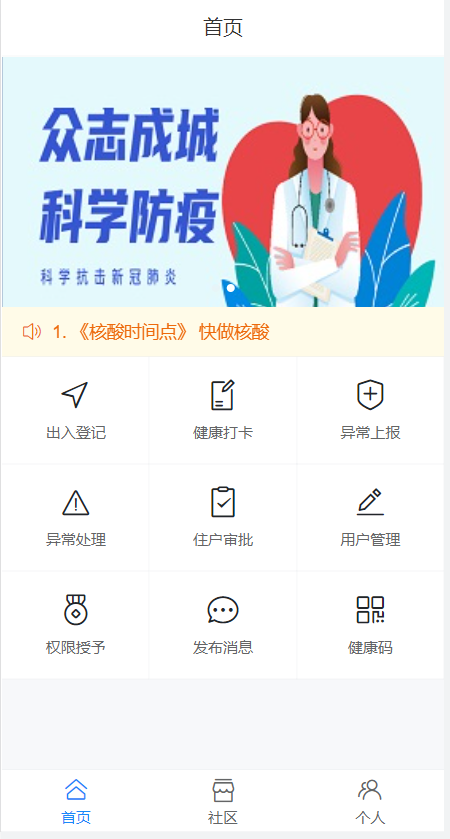 | 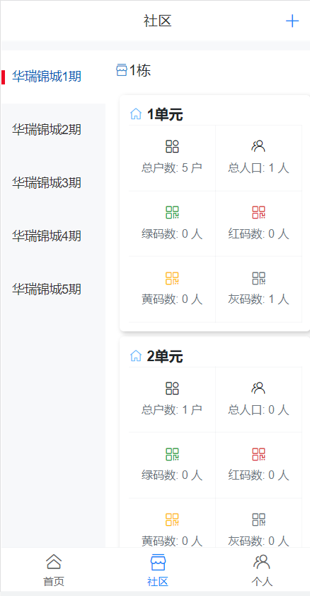 | 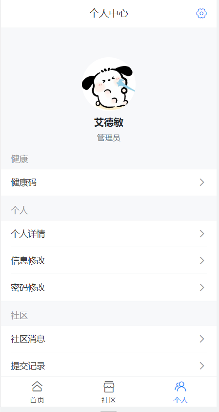 |
| 出入登记                                     | 用户管理                                     | 权限授予                                     |
| 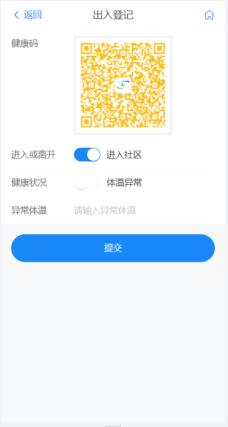 | 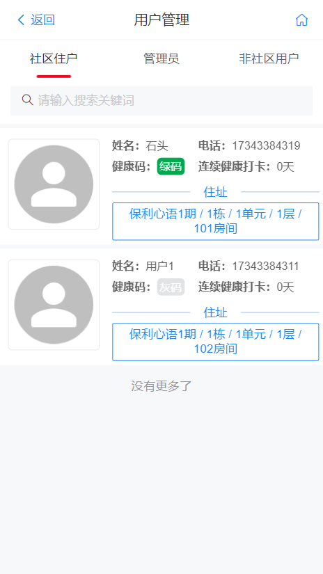 | 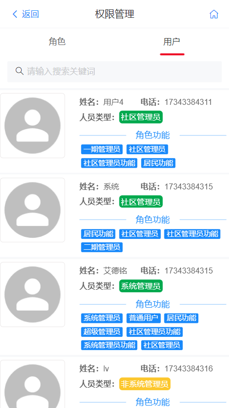 |
| 发布消息                                     | 社区创建                                     | 提交记录                                     |
| 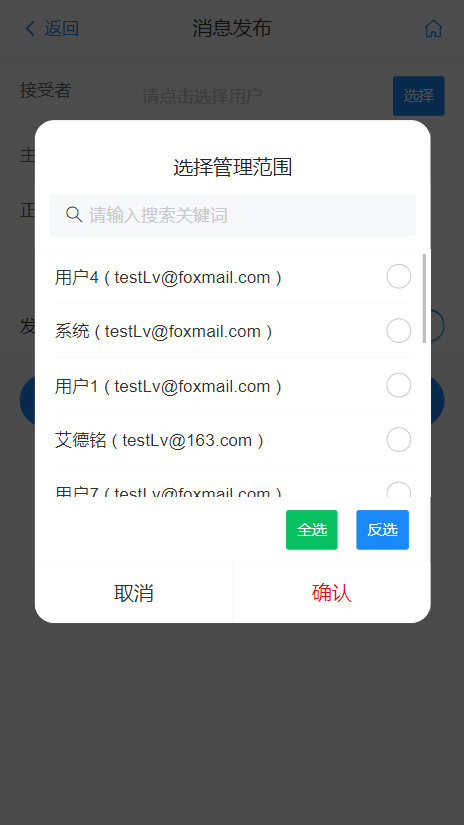 | 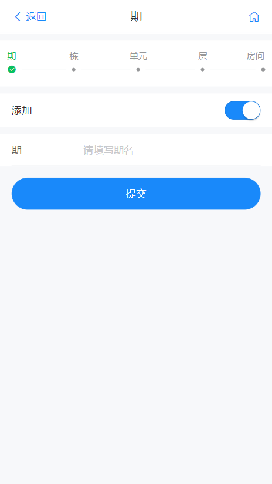 | 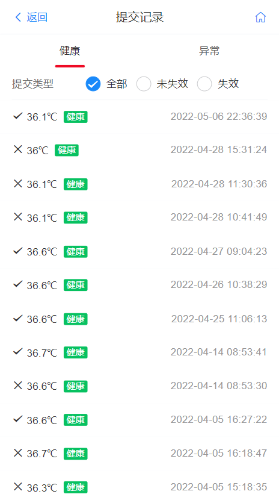 |

| 健康打卡                                     | 社区消息                                     | 信息修改                                     |
| ---------------------------------------- | ---------------------------------------- | ---------------------------------------- |
|  | 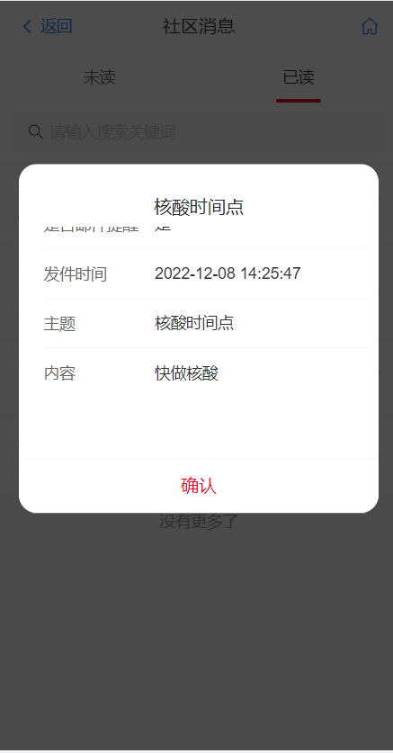 | 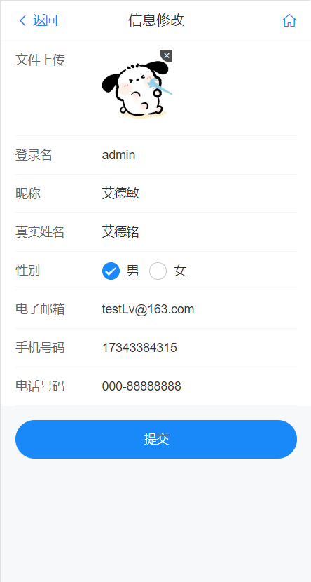 |

| 填入住址                                     | 审批通过                                     | 转码颜色                                     |
| ---------------------------------------- | ---------------------------------------- | ---------------------------------------- |
|  | 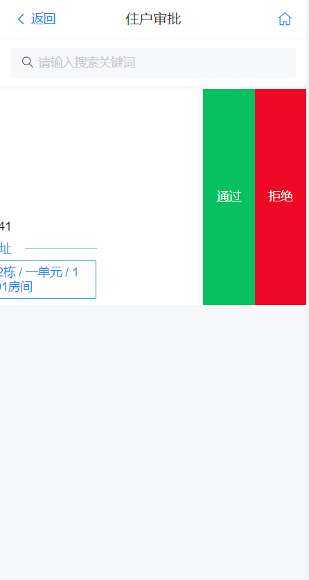 | 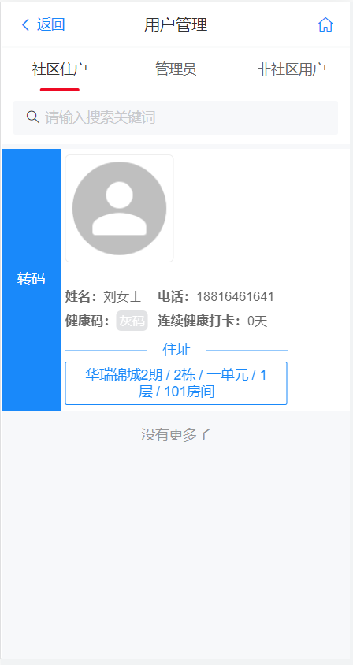 |


## 项目介绍

本系统主要实现的功能包括健康打卡、异常上报、用户出入登记、系统健康码、社区信息统计、住户审批、系统消息、异常处理、用户管理等功能。通过使用本网站，社区用户可以方便的线上完成信息填写，管理员可以便捷的进行防疫信息统计与管理。

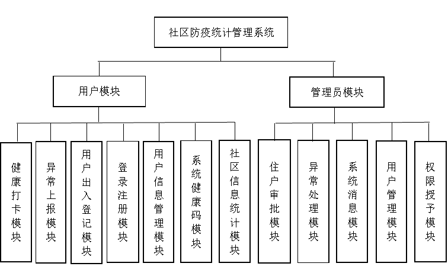

系统后端使用SpringBoot框架，使用Mysql来实现数据的持久化，并且使用了MyBaitis-Plus进行数据桥接。整合了Shiro来进行权限控制，并且使用了Redis进行数据缓存极大提高了访问速度。

系统前端使用了Vue框架进行开发，使用了优秀的移动端UI框架Vant进行界面的美化，非常适合在移动端设备上进行操作。同时前端项目可以使用HbuildX打包成Andriod程序，来安装到手机上。

## 运行环境

开发工具：IDEA（后端编译器）、Vscode（前端编译器）

JDK版本：1.8

NodeJs版本：8.0以上

数据库：MySQL8.0以上

项目管理：Maven（用于springboot项目下载依赖）

## 环境安装

每个环境安装均在csdn专栏有详细讲解，欢迎给博主和专栏点个关注:blue_heart:

[点击进入专栏](https://blog.csdn.net/m0_46381569/category_12335024.html)

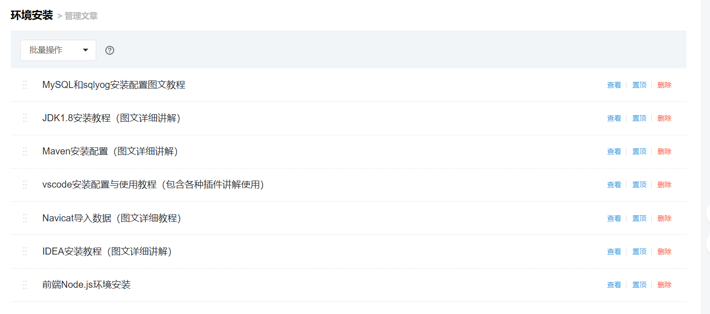

## 后端运行

建议查看本人csdn文章，里面详细讲解了IDEA启动Springboot项目

[ 点击进入文章：IDEA运行SpringBoot项目](https://blog.csdn.net/m0_46381569/article/details/131121562?csdn_share_tail=%7B%22type%22%3A%22blog%22%2C%22rType%22%3A%22article%22%2C%22rId%22%3A%22131121562%22%2C%22source%22%3A%22m0_46381569%22%7D)

### 导入Mysql脚本

> [Navicat导入数据教程](https://blog.csdn.net/m0_46381569/article/details/131121357)

数据文件是在/SQL目录下的l_community.sql，运行后就能看到 l_community数据库，后续需要在后端文件修改yml文件配置，设置为自己数据库的账号和密码。

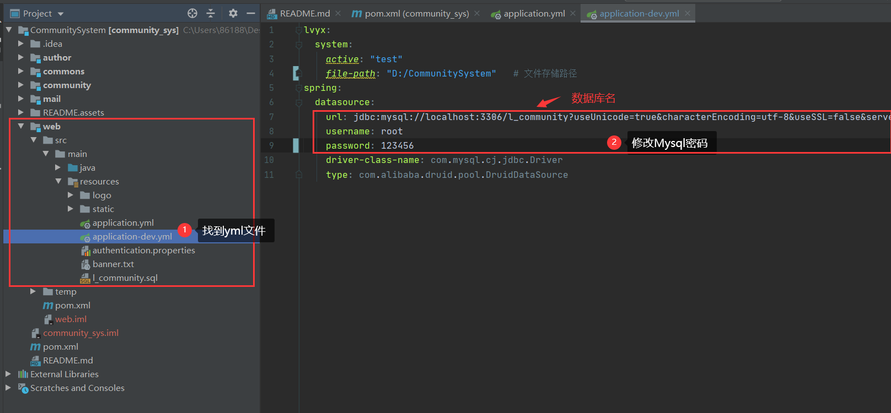


### IDEA打开后端文件

File - open -选择源码文件下的文件夹（这里需要打开CommunitySystem)

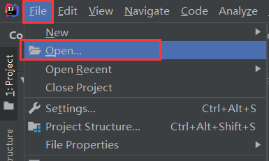

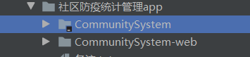

这样就成功导入源码

### 后端模块说明

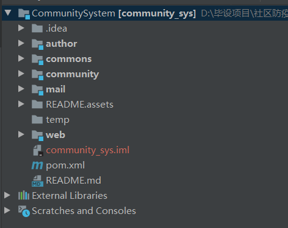

1. web模块：项目的入口，通过该模块启动整个项目
2. commons模块：公共模块，系统的一些公共的工具类等
3. ahtuor模块：用户管理模块，负责系统用户的管理，以及权限的控制等
4. mail模块：负责系统内邮件通知
5. community模块：社区业务处理模块


### 配置静态资源目录

> 本系统构建了一套本地文件上传下载服务，需要在配置文件中指定静态资源目录的位置，用于存放用户头像和网站的logo等图片。

配置：

```yaml
lvyx:
  system:
    file-path: "/app/community_system_file" # 文件存储路径
    logo-path: "/app/community_system_file/STATIC/logo/logo.png" # logo存储路径
```

配置好静态资源路径后和网站logo路径后，请将项目中`web/resources/logo/logo.png`图片放置到对应位置，否则在使用健康码的时候无法加载网站logo导致二维码无法展示。

注意：路径可以写相对路径和绝对路径

### 环境配置

参考[ 点击进入文章：IDEA运行SpringBoot项目](https://blog.csdn.net/m0_46381569/article/details/131121562?csdn_share_tail=%7B%22type%22%3A%22blog%22%2C%22rType%22%3A%22article%22%2C%22rId%22%3A%22131121562%22%2C%22source%22%3A%22m0_46381569%22%7D)


### 后端项目启动

正常项目环境搭建完成，右上角会有绿色三角形图标，点击此处即运行！

如果右上角没有，在web模块中找到CommunitySystemApplication文件，如下方式二，也可运行项目

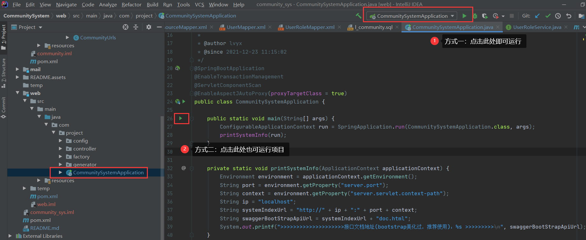

出现下图表示启动成功

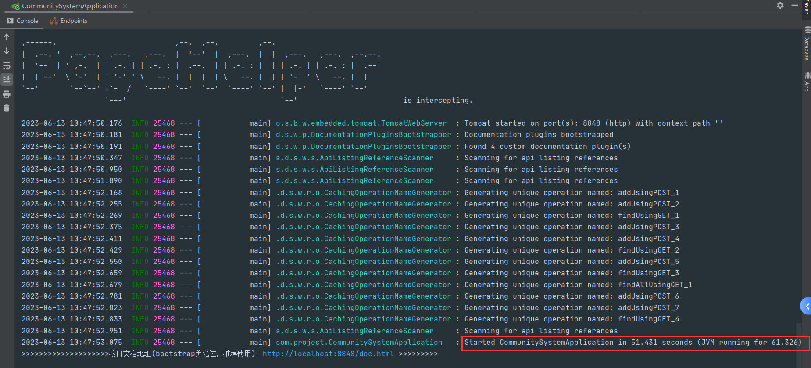

本项目是SpringBoot+Vue框架的前后端分离项目，需要运行前端Vue项目后在网页上输入地址


## 前端运行

建议查看本人csdn文章，里面详细讲解了启动Vue项目

[ 点击进入文章：IDEA运行SpringBoot项目](https://blog.csdn.net/m0_46381569/article/details/131120657)

首先是安装NodeJS环境，这样就能使用npm命令下载vue.js脚手架了

此前端项目的运行命令为：

> npm run serve

显示如下界面表示运行成功，在浏览器输入地址打开

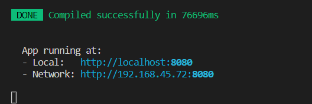


因为项目是app，如果要在浏览器中访问的话，需要 右键-》检查，打开开发者模块，并点击手机适配按钮

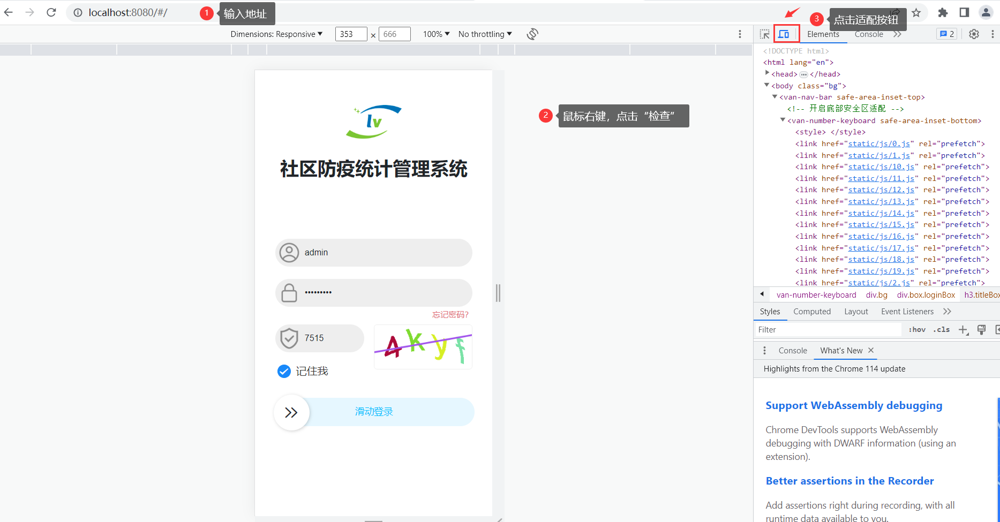


到这里前后端就启动完成了，后续修改数据表的内容，重新刷新页面就能看到变化。

功能调试时试试左右滑动，很多功能隐藏在里面！

最后，喜欢的欢迎点点star:blue_heart:

源码获取关注个人公众号：楠哥毕设帮

提供个人二开项目源码、部署讲解、论文指导~


